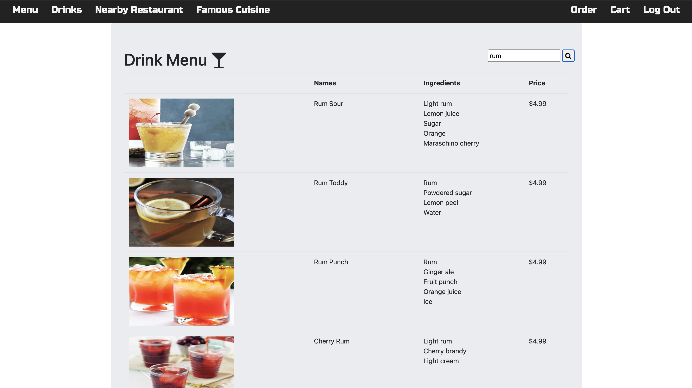
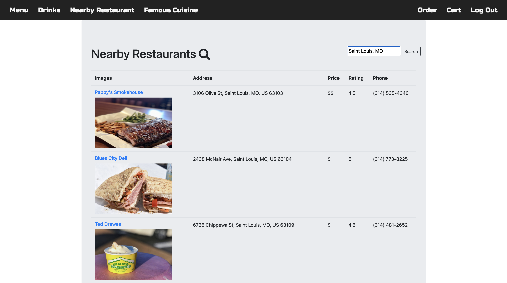
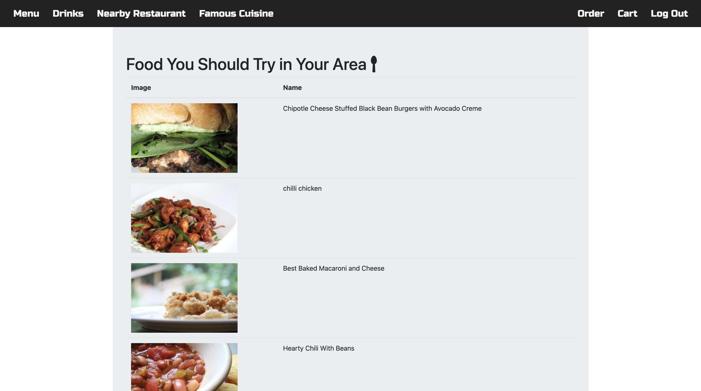
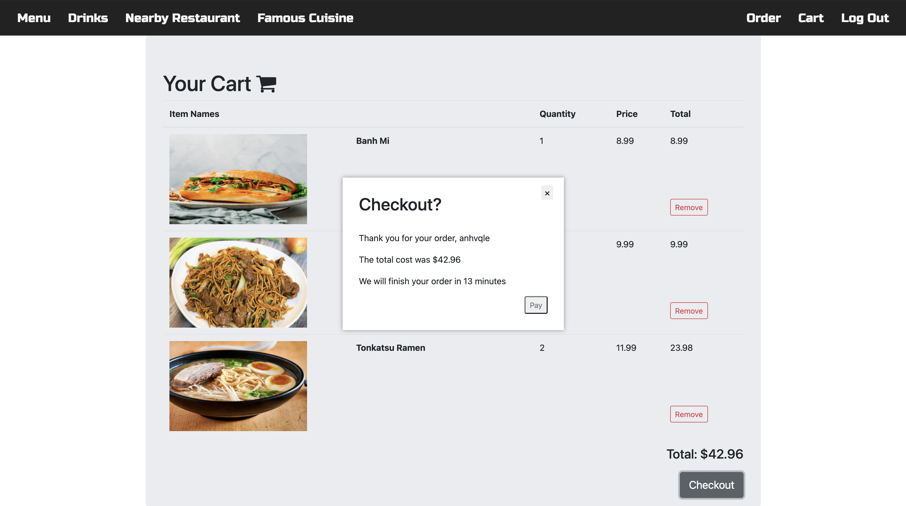
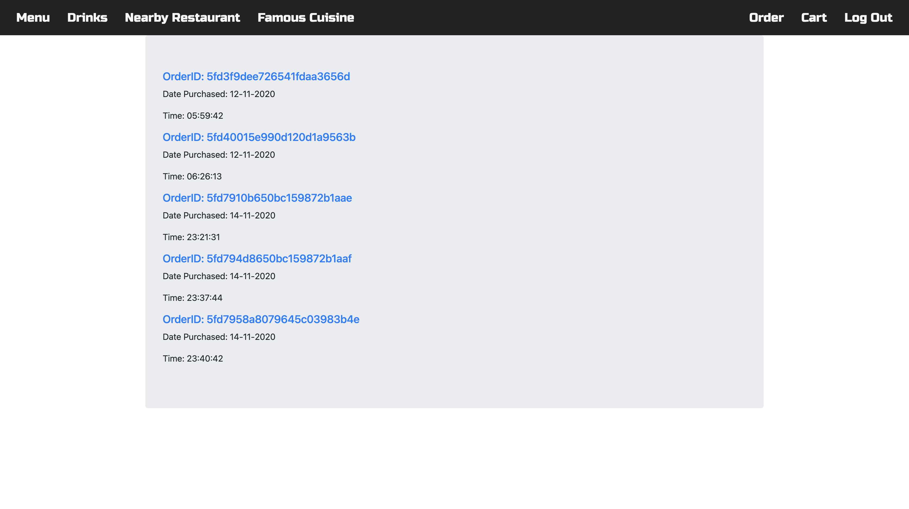

# CSE330
488493

488494

# Cart & Go  
"Cart & Go" allows user to select food & drink from a restaurant with premade menu. The app also allows user to get food/restaurant recommendations based on their location.

#### Visit Our Website Here:  
http://ec2-3-137-176-157.us-east-2.compute.amazonaws.com:3000/

# Grading Rubric
There are 100 points in total. 
1. Turn in rubric and get it checked out by TA (5 points)

2. Languages/Frameworks used (15 points)
- JavaScript as frontend tools (0 points)
- EJS to generate HTML on client-side (5 points)
- Node.js Express as backend tools (5 points)
- MongoDB as the project's main database (5 points)

3. Functionalities (65 points)
- User Data Management (15 points):
    - New users can register/log in using their previously created account (3 points).
    - Paswords are hashed, salted, and checked securely (3 points).
    - Users can log out (3 points).
    - User information are safely stored in a MongoDB database (6 points).
- Food Section (20 points):
    - Successfully displayed a premade menu (5 points).
    - Users should be able to add meals to their cart and checkout (10 points).
    - A notification should pop up on main screen about the total cost of the order (5 points).
- Food recommendation by location (20 points):
    - Users can see a list of restaurant recommendations based on their nearby location (10 points).
    - Users can see a list of famous food in the country they are in (10 points).
- Drinks Section (10 points):
    - Utilize an free online APIs to generate drinks based on the user's ingredient options (5 points). 
    - A notification is sent to users when they checkout a drink in their cart (5 points). 

4. Creative Portion (15 points)
- Additional App Features:
    - Example 1: Beside logging in as customer, users have an option to login as restaurant's owner to customize their own menu (cost, wait time, food, etc) and then the new restaurant will be added as a option for customers to choose food from (15 points).
    - Example 2: User's order history is saved for future reference in a MongoDB database. User can see their detailed history orders with purchased date, purchased items, quantity, total cost, etc.  
    - Example 3: Reset password functionality  

- Example 2 and 3 are what we implemented for the creative portion.  

# App Demo
### Log In/Register Page

### Main Menu

### Drink Menu

### Nearby Restaurant Recommendation

### Famous Cuisine

### User's Cart

### Order History
